  
  Continuing from the Python script output, this is the visualizaiton/modeling part of the project.


```r
#import final dataset from python script
academy = read.csv("C:\\Users\\Patrick\\Documents\\academy_final_dataset.csv")
library(ggplot2)
library(dplyr)
```

```
## 
## Attaching package: 'dplyr'
```

```
## The following objects are masked from 'package:stats':
## 
##     filter, lag
```

```
## The following objects are masked from 'package:base':
## 
##     intersect, setdiff, setequal, union
```

```r
library(tidyr)
library(stringr)
```
Here I'm creating  genre dataframe to look at academy winners by genres (by count and percentages) and plot the corrensponding barplot


```r
#create genre dataframe to look at academy winners by genres (by count and percentages) and plot the corrensponding barplot.
genres=select(filter(academy,winner == 1),contains("Genre"))
genres=genres %>% rename_at(vars(starts_with("Genre_")),funs(str_replace(.,"Genre_","")))
```

```
## Warning: funs() is soft deprecated as of dplyr 0.8.0
## Please use a list of either functions or lambdas: 
## 
##   # Simple named list: 
##   list(mean = mean, median = median)
## 
##   # Auto named with `tibble::lst()`: 
##   tibble::lst(mean, median)
## 
##   # Using lambdas
##   list(~ mean(., trim = .2), ~ median(., na.rm = TRUE))
## This warning is displayed once per session.
```

```r
genres = data.frame(colname=names(genres),counts = colSums(genres))
genres_all=select(academy,contains("Genre"))
genres_all=genres_all %>% rename_at(vars(starts_with("Genre_")),funs(str_replace(.,"Genre_","")))
genres_all = data.frame(colname=names(genres_all),counts = colSums(genres_all))
genres_all=left_join(genres_all,genres,by='colname')
genres_all$percentage=genres_all$counts.y/genres_all$counts.x

#descriptive plots
theme_update(text= element_text(size=20))
ggplot(genres, aes(x=reorder(colname,counts),y=counts,label=counts))+
geom_point(stat="identity",fill="orange",size=11,color="turquoise4")+
geom_segment(aes(y=0,
x=colname,
yend=counts,
xend=colname),
size=3,color="turquoise4")+
scale_color_manual(values=c("0"="grey", "1"="orange"))+
geom_text(color="white",size=4,fontface="bold")+
labs(x="Genre",
y="Counts",
title="Count of Academy Award Winners by Genre",
subtitle="Dataset: Academy Awards From 1980",
caption="By: Patrick Prothro")+
theme(plot.title=element_text(face="bold"),
plot.caption=element_text(face="bold"),
axis.text.x = element_text(face="bold"),
axis.title.x=element_text(face="bold"),
axis.title.y=element_text(face="bold"),
legend.position="none")+
theme_bw()+
ylim(0,110)+
coord_flip()
```

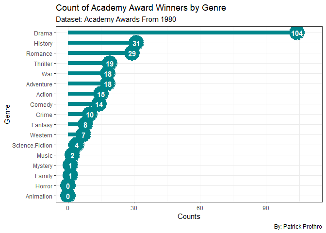<!-- -->

```r
ggplot(genres_all, aes(x=reorder(colname,percentage),y=percentage*100,label=round(percentage,2)*100))+
geom_point(stat="identity",fill="orange",size=11,color="tomato4")+
geom_segment(aes(y=0,
x=colname,
yend=percentage*100,
xend=colname),
size=3,color="tomato4")+
scale_color_manual(values=c("0"="grey", "1"="orange"))+
geom_text(color="white",size=4,fontface="bold")+
labs(x="Genre",
y="Percentage",
title="Percentage of Time Genre Nominated is a Winner",
subtitle="Dataset: Academy Awards From 1980",
caption="By: Patrick Prothro")+
theme(plot.title=element_text(face="bold"),
plot.caption=element_text(face="bold"),
axis.title.x=element_text(face="bold"),
axis.title.y=element_text(face="bold"),
legend.position="none")+
theme_bw()+
ylim(0,100)+
coord_flip()
```

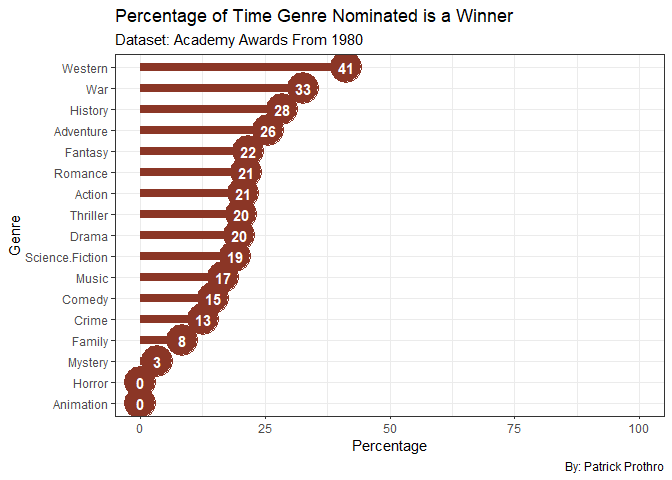<!-- -->
I found the above plots interesting because they give a sense of what type of movies are winning these awards. The first plot gives a raw count of winners by genre. Drama is the overwhelmingly majority winner, which I believe intuitively makes sense. Drama as a genre is fairly ambiguous and can probably be considered a sub-genre within most movie types. What I believe is more interesting is that in the three categories we are predicting on, movies in Animation and Horror have not won once! The second plot is also interesting as it describes when nominated what percentage of the time that genre is winning. Given the large counts of war movies that have been nominated as well as the fact that they win nearly a third of the time when they are nominated, war movies always seem to be a safe bet to be taken seriously at the Academy Awards. 

Similar to ploting by genre I'm doing the same for cast, direction, producer, production company,
and cinematographer.


```r
cast=select(filter(academy,winner == 1),contains("Cast"))
cast=cast %>% rename_at(vars(starts_with("Cast_")),funs(str_replace(.,"Cast_","")))
cast = data.frame(colname=names(cast),counts = colSums(cast))
cast=arrange(cast,desc(counts))[1:15,]

ggplot(cast, aes(x=reorder(colname,counts),y=counts,label=counts))+
  geom_point(stat="identity",fill="orange",size=11,color="turquoise4")+
  geom_segment(aes(y=0,
                   x=colname,
                   yend=counts,
                   xend=colname),
               size=3,color="turquoise4")+
  scale_color_manual(values=c("0"="grey", "1"="orange"))+
  geom_text(color="white",size=4,fontface="bold")+
  labs(x="Actor/Actress",
       y="Counts",
       title="Count of Academy Award Winners by Actors/Actresses in Movie",
       subtitle="Dataset: Academy Awards From 1980",
       caption="By: Patrick Prothro")+
  theme(plot.title=element_text(face="bold"),
        plot.caption=element_text(face="bold"),
        axis.title.x=element_text(face="bold"),
        axis.title.y=element_text(face="bold"),
        legend.position="none")+
  theme_bw()+
  ylim(0,100)+
  coord_flip()
```

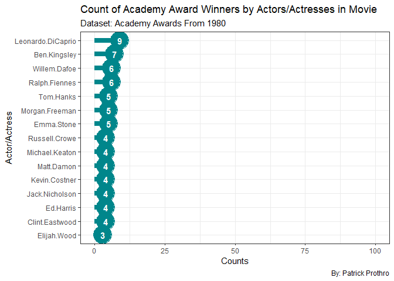<!-- -->

```r
director=select(filter(academy,winner == 1),contains("Director"))
director=director %>% rename_at(vars(starts_with("Director_")),funs(str_replace(.,"Director_","")))
director = data.frame(colname=names(director),counts = colSums(director))
director=arrange(director,desc(counts))[1:15,]

ggplot(director, aes(x=reorder(colname,counts),y=counts,label=counts))+
  geom_point(stat="identity",fill="orange",size=11,color="turquoise4")+
  geom_segment(aes(y=0,
                   x=colname,
                   yend=counts,
                   xend=colname),
               size=3,color="turquoise4")+
  scale_color_manual(values=c("0"="grey", "1"="orange"))+
  geom_text(color="white",size=4,fontface="bold")+
  labs(x="Director",
       y="Counts",
       title="Count of Academy Award Winners by Director in Movie",
       subtitle="Dataset: Academy Awards From 1980",
       caption="By: Patrick Prothro")+
  theme(plot.title=element_text(face="bold"),
        plot.caption=element_text(face="bold"),
        axis.title.x=element_text(face="bold"),
        axis.title.y=element_text(face="bold"),
        legend.position="none")+
  theme_bw()+
  ylim(0,100)+
  coord_flip()
```

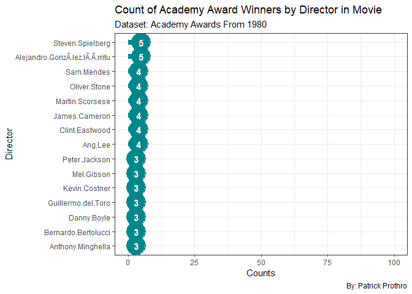<!-- -->

```r
cinematographer=select(filter(academy,winner == 1),contains("Cinematographer"))
cinematographer=cinematographer %>% rename_at(vars(starts_with("Cinematographer_")),funs(str_replace(.,"Cinematographer_","")))
cinematographer = data.frame(colname=names(cinematographer),counts = colSums(cinematographer))
cinematographer=arrange(cinematographer,desc(counts))[1:15,]

ggplot(cinematographer, aes(x=reorder(colname,counts),y=counts,label=counts))+
  geom_point(stat="identity",fill="orange",size=11,color="turquoise4")+
  geom_segment(aes(y=0,
                   x=colname,
                   yend=counts,
                   xend=colname),
               size=3,color="turquoise4")+
  scale_color_manual(values=c("0"="grey", "1"="orange"))+
  geom_text(color="white",size=4,fontface="bold")+
  labs(x="cinematographer",
       y="Counts",
       title="Count of Academy Award Winners by Cinematographer in Movie",
       subtitle="Dataset: Academy Awards From 1980",
       caption="By: Patrick Prothro")+
  theme(plot.title=element_text(face="bold"),
        plot.caption=element_text(face="bold"),
        axis.title.x=element_text(face="bold"),
        axis.title.y=element_text(face="bold"),
        legend.position="none")+
  theme_bw()+
  ylim(0,100)+
  coord_flip()
```

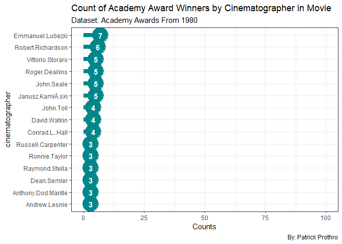<!-- -->

```r
#by producer
producer=select(filter(academy,winner == 1),contains("producer"))
producer=producer %>% rename_at(vars(starts_with("Producer_")),funs(str_replace(.,"Producer_","")))
producer = data.frame(colname=names(producer),counts = colSums(producer))
producer=arrange(producer,desc(counts))[1:15,]

ggplot(producer, aes(x=reorder(colname,counts),y=counts,label=counts))+
  geom_point(stat="identity",fill="orange",size=11,color="turquoise4")+
  geom_segment(aes(y=0,
                   x=colname,
                   yend=counts,
                   xend=colname),
               size=3,color="turquoise4")+
  scale_color_manual(values=c("0"="grey", "1"="orange"))+
  geom_text(color="white",size=4,fontface="bold")+
  labs(x="producer",
       y="Counts",
       title="Count of Academy Award Winners by Producer in Movie",
       subtitle="Dataset: Academy Awards From 1980",
       caption="By: Patrick Prothro")+
  theme(plot.title=element_text(face="bold"),
        plot.caption=element_text(face="bold"),
        axis.title.x=element_text(face="bold"),
        axis.title.y=element_text(face="bold"),
        legend.position="none")+
  theme_bw()+
  ylim(0,100)+
  coord_flip()
```

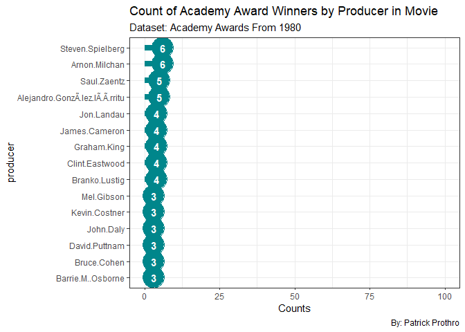<!-- -->

```r
#by production_company
production_company=select(filter(academy,winner == 1),contains("Production_Company"))
production_company=production_company %>% rename_at(vars(starts_with("Production_Company_")),funs(str_replace(.,"Production_Company_","")))
production_company = data.frame(colname=names(production_company),counts = colSums(production_company))
production_company=arrange(production_company,desc(counts))[1:15,]

ggplot(production_company, aes(x=reorder(colname,counts),y=counts,label=counts))+
  geom_point(stat="identity",fill="orange",size=11,color="darkorange3")+
  geom_segment(aes(y=0,
                   x=colname,
                   yend=counts,
                   xend=colname),
               size=3,color="darkorange3")+
  scale_color_manual(values=c("0"="grey", "1"="orange"))+
  geom_text(color="white",size=4,fontface="bold")+
  labs(x="production_company",
       y="Counts",
       title="Count of Academy Award Winners by Production Company in Movie",
       subtitle="Dataset: Academy Awards From 1980",
       caption="By: Patrick Prothro")+
  theme(plot.title=element_text(face="bold"),
        plot.caption=element_text(face="bold"),
        axis.title.x=element_text(face="bold"),
        axis.title.y=element_text(face="bold"),
        legend.position="none")+
  theme_bw()+
  ylim(0,100)+
  coord_flip()
```

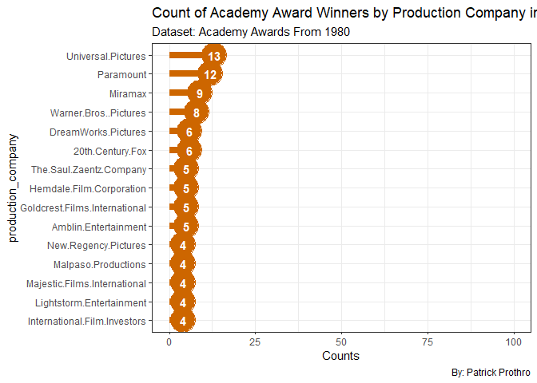<!-- -->

Next I did a plot of nominations by MPAA rating separted by winners and non-winners.


This plot shows that overwhelmingly movies rated R, are nominated and end up winning Academy Awards. At first glance I found this surprising, my guess from a marketing standpoint was that a PG-13 rating would strike the perfect balance of widespread consumption, but still being able to display moderately mature themes that these awards garner. Further research I found, showed that since the MPAA Rating system came into existence that overwhelmingly most movies are rated R(58%) . This could very well help explain this chart.


```r
academy1 = read.csv("C:\\Users\\Patrick\\Documents\\academy_dataset.csv")
academy1=academy1 %>% 
  mutate(Critics_Average_Score= ifelse(is.na(Critics_Average_Score), mean(Critics_Average_Score,na.rm=TRUE),Critics_Average_Score))
ggplot(academy1,aes(x=MPAA_Rating,fill=as.factor(winner))) + theme_bw() + 
  geom_bar()+
  scale_fill_discrete(labels = c("No", "Yes")) + 
  labs(y="Count of Nominations",
       x = "MPAA Rating", 
       title= "Comparison of winners to non-winners by MPAA Rating",
       subtitle="Dataset: Academy Awards From 1980",
       caption="By: Patrick Prothro",
       fill = "Did Nomination Win?")
```

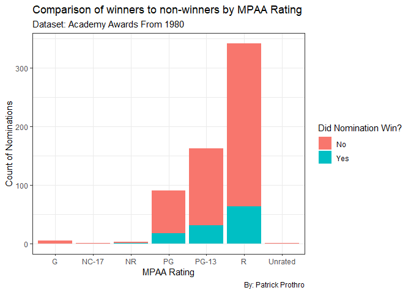<!-- -->

I created a scatterplot of Budget vs. Revenue and given the results I decided to log transform both variables going forward to account for the wide spread of values.


```r
bud_rev= select(academy,Title,Budget,Revenue,winner)
bud_rev = distinct(bud_rev)
options(scipen=999)
ggplot(bud_rev, aes(x=Budget,y=Revenue,color=as.factor(winner)))+
  geom_point()+
  scale_color_manual(values=c('#56B4E9','#E69F00'))+
  labs(x="Budget",
       y="Revenue",
       title="Scatterplot: Budget v. Revenue",
       subtitle="Dataset: Academy Awards From 1980",
       caption="By: Patrick Prothro")+
  theme(legend.position="none")+
  theme_bw()
```

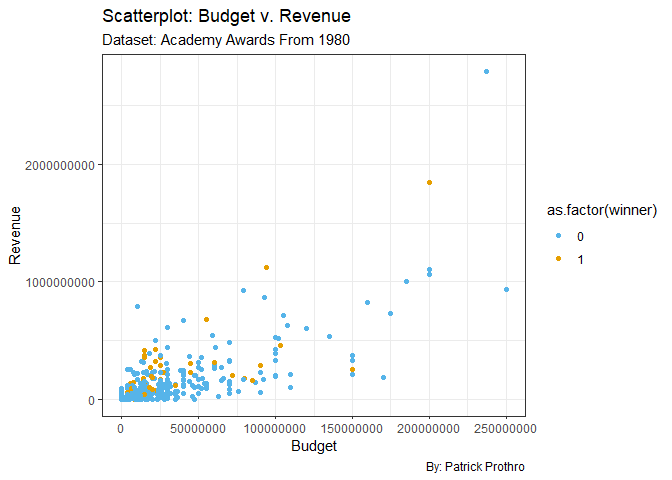<!-- -->

Next I created some density plots split by winners and non-winners to see if there are some interesting splits.


```r
#density plot of budget separated by winners and non-winners
academy1$Budget = academy1$Budget+1
academy1$Budget_log=log(academy1$Budget)

ggplot(academy1, aes(x=Budget_log,fill=as.factor(winner)))+
  theme_bw()+
  geom_density(alpha=.5)+
  scale_fill_discrete(labels = c("No", "Yes")) +
  labs(y="Density",
       x="Budget(log scale)",
       title= "Comparison of winners to non-winners by Budget",
       subtitle="Dataset: Academy Awards From 1980",
       caption="By: Patrick Prothro",
       fill = "Did Nomination Win?")
```

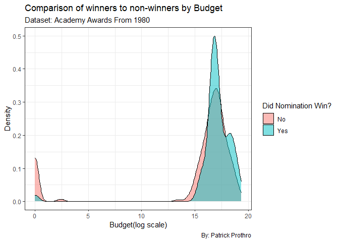<!-- -->

```r
#density plot of runtime separated by winners and non-winners
ggplot(academy1, aes(x=Runtime,fill=as.factor(winner)))+
  theme_bw()+
  geom_density(alpha=.5)+
  scale_fill_discrete(labels = c("No", "Yes")) +
  labs(y="Density",
       x="Runtime(minutes)",
       title= "Comparison of winners to non-winners by Runtime",
       subtitle="Dataset: Academy Awards From 1980",
       caption="By: Patrick Prothro",
       fill = "Did Nomination Win?")
```

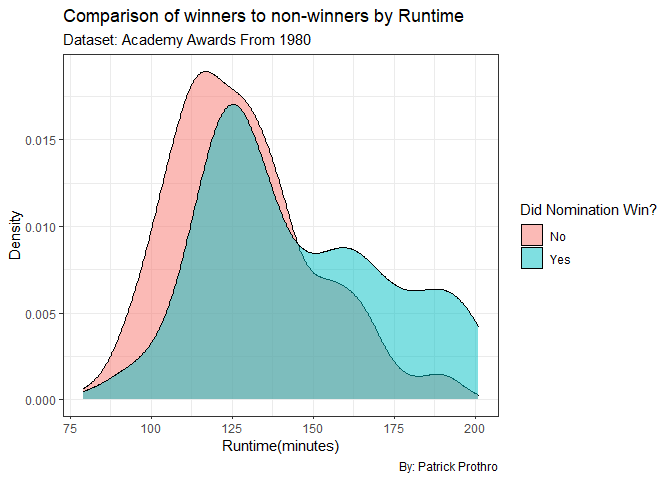<!-- -->

```r
#density plot of revenue separated by winners and non-winners
academy1$Revenue = academy1$Revenue+1
academy1$Revenue_log=log(academy1$Revenue)
ggplot(academy1, aes(x=Revenue_log,fill=as.factor(winner)))+
  theme_bw()+
  geom_density(alpha=.5)+
  scale_fill_discrete(labels = c("No", "Yes")) +
  labs(y="Density",
       x="Revenue(log scale)",
       title= "Comparison of winners to non-winners by Revenue",
       subtitle="Dataset: Academy Awards From 1980",
       caption="By: Patrick Prothro",
       fill = "Did Nomination Win?")
```

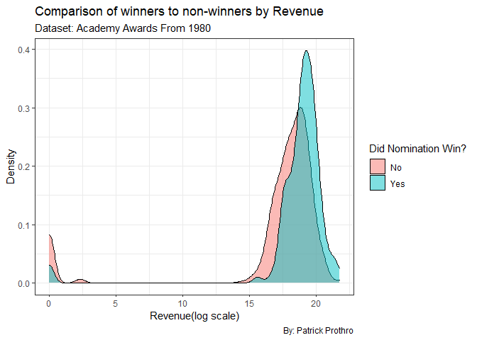<!-- -->

```r
#density plot of review scores separated by winners and non-winners
ggplot(academy1, aes(x=Critics_Average_Score,fill=as.factor(winner)))+
  theme_bw()+
  geom_density(alpha=.5)+
  scale_fill_discrete(labels = c("No", "Yes")) +
  labs(y="Density",
       x="Review Score",
       title= "Comparison of winners to non-winners by Rotten Tomatoes Review",
       subtitle="Dataset: Academy Awards From 1980",
       caption="By: Patrick Prothro",
       fill = "Did Nomination Win?")
```

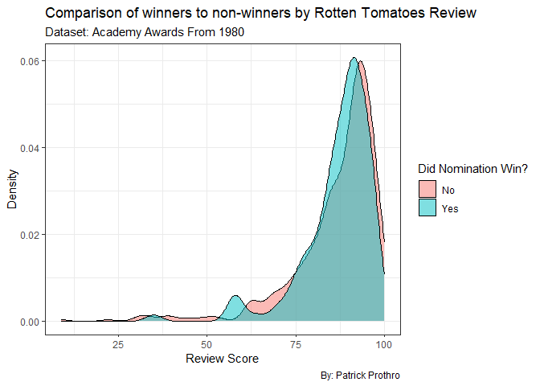<!-- -->

```r
#density plot of winners separated by revenue
academy1=academy1 %>% arrange(year,category,Release_date) %>% group_by(year,category) %>% 
  mutate(rank = rank(Release_date))


ggplot(academy1, aes(x=rank,fill=as.factor(winner)))+
  theme_bw()+
  geom_density(alpha=.5)+
  scale_fill_discrete(labels = c("No", "Yes")) +
  labs(y="Density",
       x="Rank of Release Date",
       title= "Comparison of winners to non-winners by most recent release date",
       subtitle="Dataset: Academy Awards From 1980",
       caption="Ranks grouped by year and category.\n
       A rank of '1' means that was the closest movie time wise to the Oscar's\n
       By: Patrick Prothro",
       fill = "Did Nomination Win?")
```

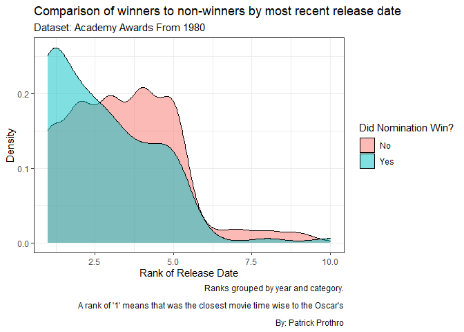<!-- -->
Seems like for runtime, budget, and revenue, the more/longer the more likely that movie is, to win an Oscar nomination.
Further delving into runtime I created a boxplot of runtimes by genres. It shows that movies that never win(Horror and Animation) are average a lot shorter than movies that when nominated win often (Westerns).


```r
#boxplot of runtimes by genre
rev = read.csv('C:\\Users\\Patrick\\Documents\\Revenue_Academy.csv')
rev$Revenue = rev$Revenue+1
rev$Revenue_log=log(rev$Revenue)
rev=rev %>% 
  mutate(type=ifelse(Genre1=="Animation","Highlighted",ifelse(Genre1=="Western","Highlighted1","Normal")))
ggplot(rev, aes(x=Genre1,y=Runtime,fill=type,alpha=type))+
  theme_bw()+
  geom_boxplot()+
  scale_fill_manual(values=c("red3", "springgreen3","grey")) +
  theme(axis.text.x = element_text(angle = 90, hjust = 1),
        legend.position="none")+
  #scale_alpha_manual(values=c(1,0.1))
  labs(y="Runtime",
       x="Genre",
       title= "Runtimes by Genres",
       subtitle="Dataset: Academy Awards From 1980",
       caption="By: Patrick Prothro"
  )
```

```
## Warning: Using alpha for a discrete variable is not advised.
```

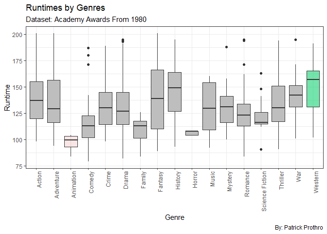<!-- -->

Last step was creating models to see if they could accurately predict Academy Award Winners. 
I first started with an xgboost algorithm which I used cross validation to tune the hyperparameters. 
I believe the correct way would be to make three models for each category, however the algorithm performed better as a single model (lack of data), so for the time being I kept it as is.


```r
#xgboost algorithm to train and test model
library(xgboost)
```

```
## 
## Attaching package: 'xgboost'
```

```
## The following object is masked from 'package:dplyr':
## 
##     slice
```

```r
academy = read.csv("C:\\Users\\Patrick\\Documents\\academy040420.csv")
#transform revenue and budget into logs because of outliers.
academy$Revenue = academy$Revenue+1
academy$Budget = academy$Budget+1
academy$Budget_log=log(academy$Budget)
academy$Revenue_log=log(academy$Revenue)
picture=academy
picture_test = filter(picture,year >=2015)
picture = filter(picture,year <2015)
labels = picture$winner
labels_test = picture_test$winner
#drop columns not used in model
drop.cols = c("year","entity","Title","Synopsis","Tagline",
              "Release_date","category","Budget","Revenue","X","winner")
picture = picture %>% select(-one_of(drop.cols))
picture_test = picture_test %>% select(-one_of(drop.cols))
names=colnames(picture)
labels=as.numeric(labels)
labels_test=as.numeric(labels_test)
picture=as.matrix(picture)
picture_test=as.matrix(picture_test)
dtrain=xgb.DMatrix(data=picture,label=labels)
#commented out code below was cross validation used for hyperparameter tuning.
#xgb.cv(data=dtrain,nround=500,max_depth=20,eta=.01,
#       subsample=.7,objective = "binary:logistic",eval_metric = "logloss",
#       seed=3,early_stopping_rounds = 50,colsample_bytree=.8,lambda=0,
#       gamma=0,nfold=5)

xgbcv = xgboost(data=dtrain,nround=300,max_depth=20,eta=.01,
                subsample=.7,objective = "binary:logistic",eval_metric = "logloss",
                seed=2,early_stopping_rounds = 50,colsample_bytree=.8,lambda=0,
                gamma=0,verbose=0)
```

```
## Warning in xgb.train(params, dtrain, nrounds, watchlist, verbose = verbose, :
## xgb.train: `seed` is ignored in R package. Use `set.seed()` instead.
```

```r
pred=predict(xgbcv,picture_test)

#plot of feature importance
xgb.ggplot.importance(xgb.importance(as.character(names),model=xgbcv),top_n=10)
```

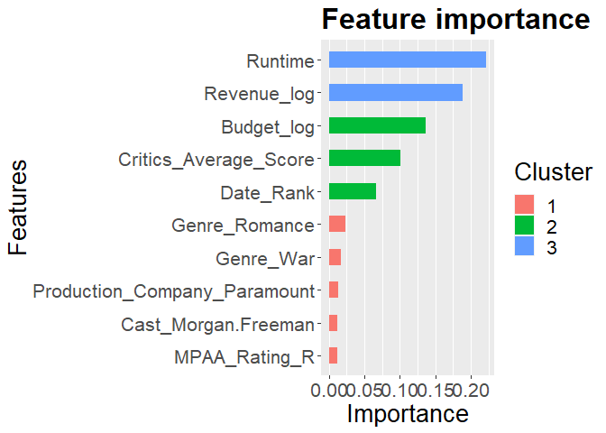<!-- -->

```r
#read in dataframe so we can align names with predictions to measure accuracy
academy = read.csv("C:\\Users\\Patrick\\Documents\\academy040420.csv")
academy$Revenue = academy$Revenue+1
academy$Budget = academy$Budget+1
academy$Budget_log=log(academy$Budget)
academy$Revenue_log=log(academy$Revenue)

picture=academy
picture_test = filter(picture,year >=2015)
picture_test$pred = pred
picture_test$y = labels_test

final=select(picture_test,category,year,Title,y,pred)
final=final %>% group_by(year,category) %>% filter(pred==max(pred))

actual=select(picture_test,category,year,Title,y,pred)
actual=filter(actual,y==1)
final$Actual_Winner=actual$Title
final=arrange(final,year)
final=rename(final,Predicted_Winner=Title)
final=rename(final,Probability=pred)
final=rename(final,Category=category)
final=rename(final,Year=year)
final=final %>%
  mutate(Result= case_when(y==1 ~ "Correct",y==0 ~ "Incorrect"))
final=select(final,Category,Year,Predicted_Winner,Actual_Winner,Probability,Result)
#creates grid object to compare predicted outcomes to actual outcomes
library(grid)
library(gridExtra)
```

```
## 
## Attaching package: 'gridExtra'
```

```
## The following object is masked from 'package:dplyr':
## 
##     combine
```

```r
plot.new()
f=tableGrob(final,theme=ttheme_default(base_size=10))
grid.draw(f)
```

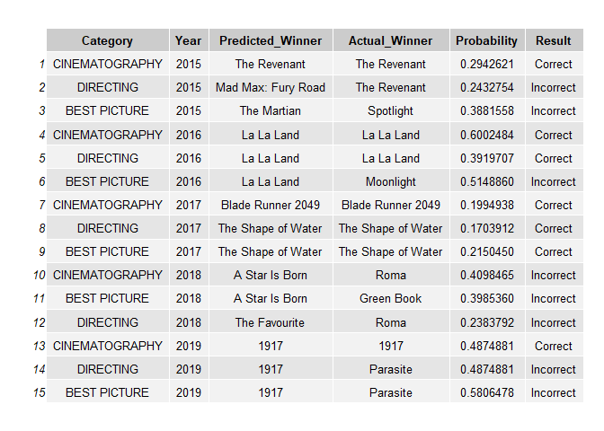<!-- -->


The model ended up predicting 8/15 movies correctly. This might not seem substansial, however that is 8/15 where each category could have 5 and potentially up to 9 different contestants. For reference, someone being able to randomly guess more than 6 out of 15 correctly is less than 1%. Also from the feature importance chart we can see that Runtime, Budget, Revenue, and Date_Rank are huge indicators of winners. This aligns a lot with what the density plots earlier showed.

While the model did great in predicting 2015, 2016, and 2017 winners it were terrible in predicting winners in 2018 and 2019. I’m curious whether this is a fault in the models or a shifting in paradigm of those assigned to vote for these movies. By most historical metrics 1917 (a war movie released in late 2019) should have won more awards, however Parasite was actually the big winner, the first South Korean film in history to win an Oscar and a movie that was released in mid-summer. Nowhere near award season. The Academy Awards have been under a lot scrutiny lately due to claimed lack of diversity in their selections of nominees and winners. Could this have an influence on recent winners such as Green Book, Roma, and Parasite? Perhaps, if this becomes a repeated pattern, maybe the models will select new important variables to predict future Oscar winners. 


In future iterations I want to try some natural language processing on the synopsis of the movies, some additional features regarding the cast involved, and the PCA to account for overwhelming amount of columns relative to the rows.
